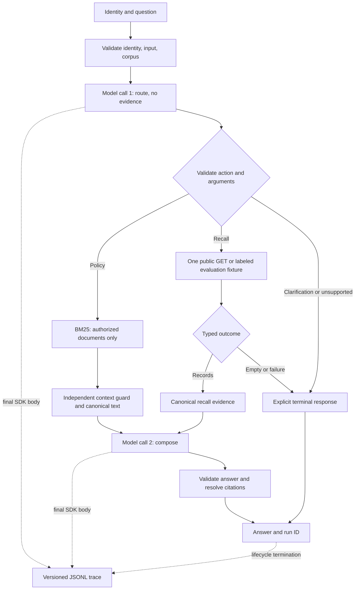

# Architecture and operating boundary

The CLI answers one question under a fixed demo identity using synthetic policies
or public year/make/model recall records. It provides neither authentication nor
VIN-specific decisions.

| Modules | Responsibility |
| --- | --- |
| `corpus`, `evaluations` | Validate metadata, paths, fingerprints, and selected splits |
| `permissions`, `retrieval` | Code-bound identity; filter before indexing and scoring |
| `tools` | Argument checks and independent canonical-evidence guard |
| `recalls`, `recall_fixtures` | Fixed endpoint, bounded parsing, typed outcomes, replay provenance |
| `graph` | Acyclic LangGraph route/execute/compose flow and terminal paths |
| `model_client`, `prompts` | Pinned OpenAI adapter, strict schema, final-body observation |
| `answers`, `tracing` | Citation membership, safe errors, durable events and inspection |
| `evaluation`, `retrieval_evaluation` | Independent scoring; semantic review stays separate |

Identity is immutable closure context. Prompt text cannot grant access. The
context guard does not call the retrieval permission helper, so the mutation can
break retrieval while generation still rejects restricted evidence. Only
canonical full text is supplied; generated retriever snippets are not trusted.

Normal `ask` calls NHTSA live when selected. Evaluation uses actual validated
arguments to select a recorded fixture, never falls back to HTTP, and never
supplies expected labels as model instructions. Public source text is untrusted
evidence. Successful empty results remain distinct from transport/HTTP/parse errors.

Traces derive IDs/hashes from final outgoing SDK bodies. Routing has no supplied
evidence. Write failures fail the request; interrupted traces are labeled
incomplete. Ordinary traces omit credentials, questions, answer prose, and
rejected restricted IDs. Administrator reports contain more and require review.
Only actual provider-reported usage is recorded.

Validated model choices emit `route_proposed` with only fixed action/reason
labels. A deterministic override emits `route_guard` before the final
`route_selected` event. This distinguishes a model clarification from a guard
rejection without storing raw router prose or policy query text. The new events
are additive to trace v1; the current inspector also reads the original traces.

Limits: one tool call, two model calls, zero retries, six graph steps, 65 seconds,
four policies, and up to five recall campaigns. Conservative guards can reject
valid questions. Negated-inference caveats no longer automatically negate a
vehicle selection; actual negations and alternatives remain blocked. A narrow
routing-only normalizer separates terminal repair-completion follow-ups; the full
question still drives argument guards and answer composition. Policy generation
selects sentence indices from authorized canonical sources, which code expands
and validates before rendering. Abstentions discard free-form model prose and
retain verified quotations and explicit coordinator contact instructions. A fixed
human-handoff suggestion does not confer approval or access. Explicit private-term
requests from technicians trigger a conservative abstention and `answer_guard`
event after permission-scoped search. Valid citations prove source membership, not
complete or correct prose, including referrals. See [M7's original failures](m7-results.md)
and [the subsequent quality repairs](m7-quality-fixes.md).
